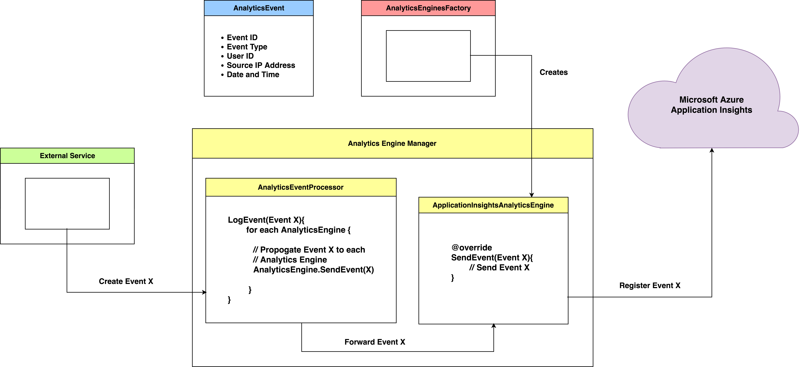

# :cyclone: :bar_chart: :chart_with_upwards_trend: :chart_with_downwards_trend: Analytics Engine Manager

Architecture design and implementation for an analytics engine manager. Incorporates the extensibility and reusability software design principles to allow the addition of new analytics engines. The code is also testable and comes with a suite of unit tests.

An analytics engine provides the means of logging and propagating an event to the cloud. The code has a working example using Azure Application Insights.

# Design Diagram


# Detailed Design Diagram


# How To Run

> Set `ApplicationInsightsInstrumentationKey` in `App.config` to the resource instrumentation key.


> Set `ApplicationInsights` in `App.config` to `true` if tracking events, `false` otherwise.

### Packages

```
Install-Package Microsoft.ApplicationInsights -Version 2.8.1
```

### With a Dependency Injection Framework
This would require you to register the following mappings to the DI container:
- `ICustomConfigurationManager` to `CustomConfigurationManager`
- `IAnalyticsEnginesFactory` to `AnalyticsEnginesFactory`
- `IAnalyticsEventProcessor` to `AnalyticsEventProcessor`

> Making them a singleton would mean that only a single object is created per project, this is fine, however, if Analytics Engine Manager, for example, is used by multiple endpoints, then all endpoints are dependent on a single resource. Usually this is not ideal.

```C#
string eventName = "";
string userID = "";
string remoteIPAddress = "";

IAnalyticsEvent analyticsEvent = new AnalyticsEvent(eventName, userID, remoteIpAddress);
AnalyticsEventProcessor.LogEvent(analyticsEvent);
```

### Without a Dependency Injection Framework
```C#
string eventName = "";
string userID = "";
string remoteIPAddress = "";

IAnalyticsEvent analyticsEvent = new AnalyticsEvent(eventName, userID, remoteIpAddress);

ICustomConfigurationManager analyticsConfigurationManager = new CustomConfigurationManager();
IAnalyticsEnginesFactory analyticsEnginesFactory = new AnalyticsEnginesFactory();
IAnalyticsEventProcessor analyticsEventProcessor = new AnalyticsEventProcessor(analyticsConfigurationManager, analyticsEnginesFactory);

analyticsEventProcessor.LogEvent(analyticsEvent);
```

# How To Add a New Analytics Engine
First, create a concrete class for the new Analytics Engine.
```C#
/// <summary>
/// Create a concrete class for the new Analytics Engine.
/// Implement the ICustomAnalyticsEngine interface.
/// </summary>
public class MyAnalyticsEngine : ICustomAnalyticsEngine
{
    public string GetAnalyticsEngineName { get; private set; }

    public void SendEvent(IAnalyticsEvent analyticsEvent)
    {
        // Send analyticsEvent to the cloud.
    }
}
```

Second, add the new concrete class to `AnalyticsEnginesFactory`.
```C#
public class AnalyticsEnginesFactory : IAnalyticsEnginesFactory
{
    public List<ICustomAnalyticsEngine> CreateAnalyticsEngines(ICustomConfigurationManager analyticsConfigurationManager)
    {
        List<ICustomAnalyticsEngine> customAnalyticsEngines = new List<ICustomAnalyticsEngine>();
        customAnalyticsEngines.Add(new ApplicationInsightsAnalyticsEngine(analyticsConfigurationManager));

        // Add an instance of the new concrete class to the list of Analytics Engines
        customAnalyticsEngines.Add(new MyAnalyticsEngine(analyticsConfigurationManager));

        return customAnalyticsEngines;
    }
}

```

# Kudos
- [What is Application Insights?](https://docs.microsoft.com/en-us/azure/application-insights/app-insights-overview)
- [Application Insights for .NET console applications](https://docs.microsoft.com/en-us/azure/application-insights/application-insights-console)
- [Application Insights API for custom events and metrics](https://docs.microsoft.com/en-us/azure/azure-monitor/app/api-custom-events-metrics)
